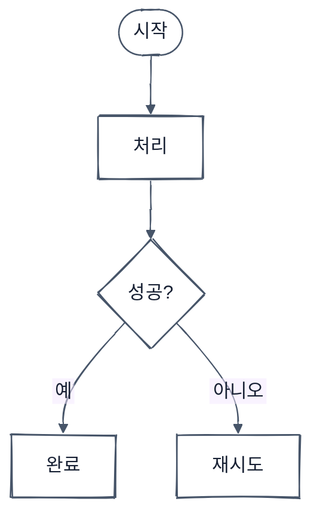

# Mermaid Hand-drawn Rendering

Use the renderer already selected by the repository. Check `command -v mmdc`
and `./node_modules/.bin/mmdc`, then record `mmdc --version`. Do not change a
project manifest or download a floating package version. If no renderer exists,
explain the missing dependency. Use existing authorization for an exact-version
installation; ask only when it is outside the authorized scope.

Start from this accessible source shape:



Quote every visible label. For a CJK flowchart, keep `htmlLabels: false`; Mermaid
11.16.0's handDrawn HTML-label path can under-measure Korean text. Keep decision
labels to one or two short words and move the full question into `accDescr` or
nearby prose. Use diamonds only for decisions and label every branch. Keep most
nodes neutral; reserve purple for the primary path, amber for attention, and red
for failure. Avoid emoji and decorative nodes.

Render both formats from the same source:

```bash
mmdc -i diagram.mmd -o diagram.svg -b white
mmdc -i diagram.mmd -o diagram.png -b white -s 2
python3 scripts/verify-artifacts.py diagram.mmd diagram.svg diagram.png
```

Run these commands from the skill directory or use an absolute path to the
verifier. If Chromium requires sandbox flags, use a temporary Puppeteer config;
do not add machine-specific flags to repository configuration.

For Korean labels, prefer earlier `<br/>` breaks and shorter wording over
smaller text. Put a long Latin identifier on its own line rather than editing
generated SVG. After deterministic verification, inspect the PNG at full
resolution for clipping, overlap, contrast, arrow direction, and group meaning.
