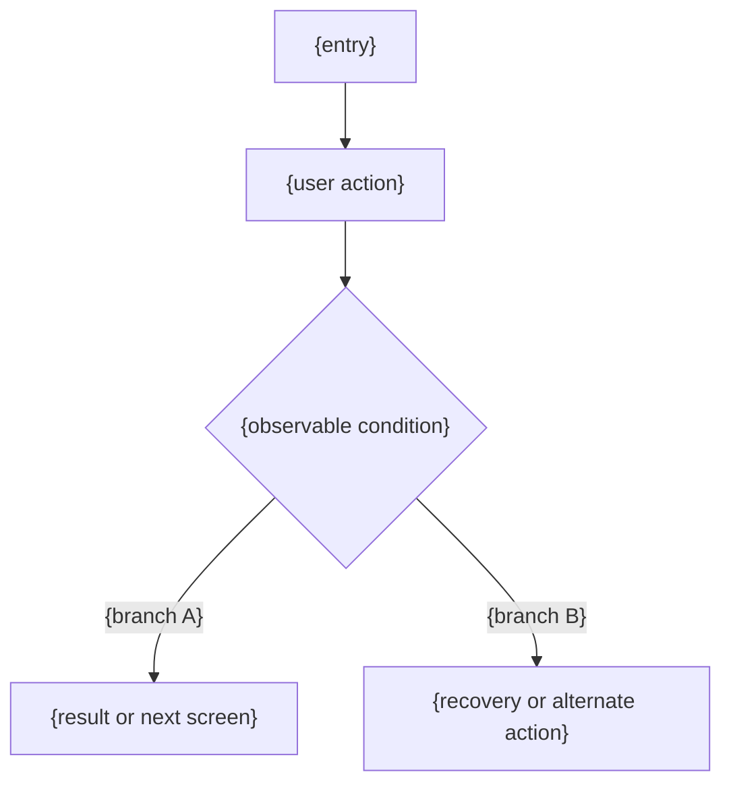

# User Flow — {feature-name}

## Assumptions and boundaries

- Source requirements: {requirement IDs or brief}
- In-scope actor: {role-1}
- Open decision: {요약}

## Flow: {primary-scenario}

Requirement mapping: {FR/AC IDs}

## Branch contract

| Branch | Trigger or precondition | Observable result | Recovery / next action | Requirements |
|---|---|---|---|---|
| {branch A} | {known condition} | {result} | {next action} | {IDs} |
| {branch B} | {known condition} | {result} | {recovery} | {IDs} |

## Flow Coverage

| Requirement or scenario | Covered flow / branch | Gap |
|---|---|---|
| {ID} | {flow and branch} | {none or open decision} |

Add another flow only for a materially different actor or lifecycle. Quote
Mermaid labels containing routes or punctuation. Do not invent authentication,
HTTP status, retry, navigation, or success behavior absent from the source.
