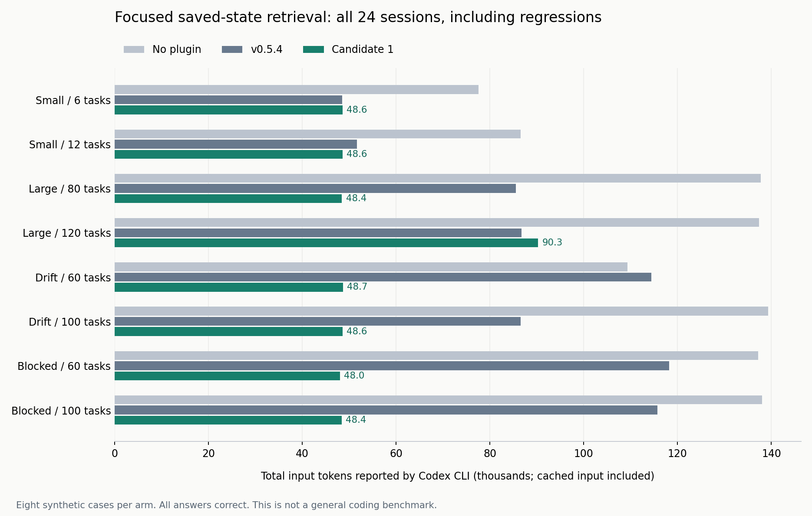
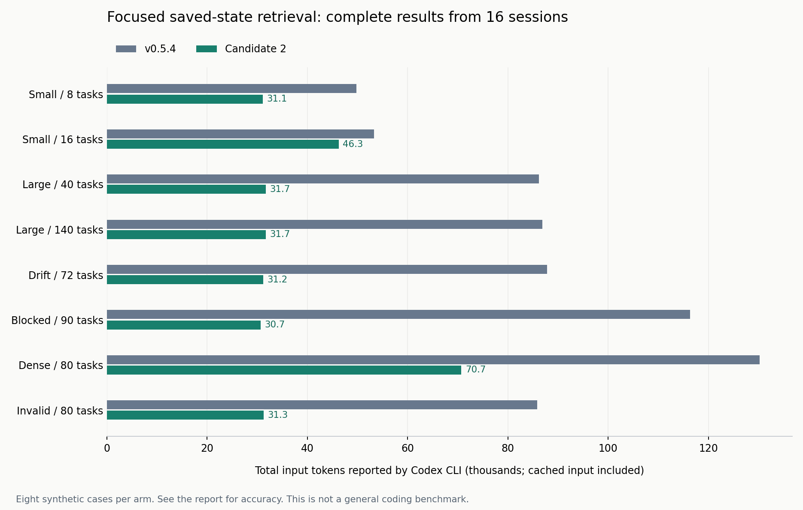

# 저장된 계획을 재개할 때, 모델에 전체 그래프를 돌려줘야 할까?

2026-09-08 · 1차 24회 + 후속 16회, 총 40개 독립 세션 실행 완료. 두 실험은 후보와 사례 구성이 다르므로 성적을 합산하지 않는다. 아래 후속 결과는 v0.5.5에 반영한 **최종 후보**에 해당한다. 실험 당시 후보의 manifest 버전은 0.5.4였으며, 릴리스에서는 두 플러그인의 manifest 버전만 0.5.5로 올렸다. Core runtime·스킬·참조 파일은 후속 후보와 동일하다. 고정된 실험 스냅샷은 변경하지 않았다.

특정 작업의 재개 상태를 조회하는 후속 8개 합성 사례에서 v0.5.4와 최종 후보는 모두 8/8 정답이었다. 최종 후보의 총입력 합계는 56.25%, 명령 실행 항목은 51.72%, 경과 시간 합계는 37.15% 감소했다. 8개 사례 모두 입력이 줄었다. 캐시 입력을 제외한 단순 차감량은 27.51% 감소했다. 이 수치는 CLI 사용량이며 청구 비용을 측정한 것이 아니다.

앞선 1차 후보의 24회 비교에서도 총입력 39.26% 감소가 있었지만 2개 사례에서는 입력이 증가했다. 이 실행을 삭제하지 않고, 사용되지 않은 조회 옵션과 참조 문서 로딩 경로를 정리한 뒤 새로운 사례에서 후속 비교했다. 같은 합성 생성기를 사용한 내부 평가이므로 일반 코딩 성능과 외부 독립 재현으로 확대하지 않는다.

## 문제와 변경

v0.5.4의 `inspect`는 모든 작업·요구사항·검사를 반환하고 다음 작업을 다시 포함한다. 특정 작업만 재개할 때도 완료된 다른 작업의 기록을 함께 읽게 된다. 이번 후보는 `inspect --task TASK-ID`를 추가한다. 선택한 작업과 전이적 선행 작업, 연결된 검사·산출물·요구사항·소스를 원래 기록 그대로 반환한다. 생략 개수를 명시하고, 전체 검증·소스 변경 경고·요약·릴리스 게이트는 유지한다. 옵션 없는 전체 조회도 유지한다.

저장된 revision과 변경 감지 후 임시 revision을 구분하도록 `saved_revision`도 추가했다. 스킬에는 작업 ID를 알고 있을 때 좁혀 조회하는 방법만 추가했다. 모델·추론 강도·토큰 한도·라우터·자동 압축은 바꾸지 않았다. 이 실험은 이러한 변경 묶음의 비교이며, 각각의 효과를 분리한 ablation은 아니다.

## 고정한 평가 설계

- 모델: GPT-6 Astra, medium. Codex CLI 0.153.4.
- 비교: 플러그인 없음 / 공개 v0.5.4 코드(`175c8e9`) / 수정 후보.
- 과제: 작은 그래프 6·12개, 큰 그래프 80·120개, 소스 변경 60·100개, 선행 작업 차단 60·100개. 8개의 새로운 합성 그래프에서 각각 두 작업의 재개 상태를 조회한다. 각 크기는 별도 사례이며 같은 과제의 반복 실행은 아니다.
- 총 24개의 새 세션. 사례 내 조건 순서를 seed 908731로 섞고 순차 실행한다.
- 플러그인 조건에만 work-planner를 명시 호출한다. 세 조건 모두 동일한 상태 파일·사용자 요구를 받는다. 도구를 사용하지 않고 직접 파일을 읽어도 동일한 의미의 답이면 통과한다.
- 정답: 생성 시 정해진 saved revision, 전체 소스 freshness·변경 경로, 두 작업의 상태·실행 가능 여부·의존성·요구사항·대상 파일·검사 명령. 후보의 필터 함수를 호출해 정답을 만들지 않는다. 배열 순서는 무관하다.
- 파일 변경·저장 명령 실행은 금지한다. 모델이 코드를 구현하거나 실제 제품 테스트를 통과시키는 과제가 아니다.
- 1차 기준: 모든 요구 필드의 정확성. 후보 8/8 정답을 유지하면서 기준 대비 총입력이 20% 이상 감소하면 이 작업 유형에서 유망하다고 판단한다. 20%는 사전에 정한 실용 기준이며 통계적 유의수준이 아니다.
- 전체 입력, 캐시 입력, 출력, 명령 항목, 경과 시간, 도구 출력 바이트를 함께 기록한다. 실패·시간 초과를 제외해 개선율을 다시 만들지 않는다. 300초 제한, 자동 재시도 없음.

## 먼저 확인한 도구 수준 결과

8개 사례에서 전체 조회와 선택 조회의 상태·실행 가능 여부·전역 변경 경고가 일치했다. 80개 작업의 응답은 108,713→8,733바이트(-91.97%), 120개는 161,924→8,756바이트(-94.59%)였다. 작업 6개에서는 10,362→8,722바이트(-15.83%)에 그쳤다. 도구 응답 바이트는 세션 토큰이나 청구 비용이 아니다.

모델 실험 시작 후 추가한 도구 경계 검사에서는 작업 80개가 하나의 선행 작업 사슬로 연결되도록 만들었다. 마지막 작업을 선택하면 전체 80개가 필요하다. 이 경우 응답은 110,172→112,540바이트로 **2.15% 증가**했다. 선택 범위 안내가 추가되기 때문이다. 따라서 이 기능은 작업 수만 많다고 이득이 생기는 것이 아니라, 요청한 작업에 필요한 부분이 전체보다 충분히 작을 때 유리하다. 이 추가 검사는 사전 고정한 모델 8개 과제의 성적에 섞지 않는다.

전체 저장소 정적 검증, 조회 테스트 14개가 통과했다. 추가로 잘못된 프로젝트·증거 파일, 선택 밖의 손상 작업, 선택 안팎의 소스 누락, 공유 검사가 참조하는 외부 요구사항 등 6개 사례를 확인했다. 이 검증은 모델 세션 수에 포함하지 않는다.

## 1차 모델 실측 결과

| 지표 · 조건당 8회 합계 | 플러그인 없음 | v0.5.4 | 1차 후보 | 후보 vs v0.5.4 |
|---|---:|---:|---:|---:|
| 정답 | 8/8 | 8/8 | 8/8 | 동일 |
| 총입력 토큰 | 963,088 | 707,372 | 429,676 | -39.26% |
| 캐시 입력 토큰 | 781,312 | 577,024 | 330,752 | -42.68% |
| 출력 토큰 | 16,927 | 5,583 | 4,273 | -23.46% |
| 명령 실행 항목 | 29 | 28 | 23 | -17.86% |
| 경과 시간(초) | 664.081 | 361.278 | 240.282 | -33.49% |

24회 모두 정상 종료했고, 사용량 누락·시간 초과·자동 재시도는 없었다. 24개 고유 세션 ID를 확인했다. 파일 해시는 모든 실행 전후 동일했다. 자동 채점은 요구된 의미 필드, 파일 변경 및 완료 여부를 확인했고, 명령 실행 금지와 평가 영역 외부 조회 여부는 동일 개발 에이전트가 명령 로그 80개를 별도로 검토했다. 독립 블라인드 검토는 아니다.

후보의 평균 총입력은 사례당 53,709.5토큰으로 기준의 88,421.5토큰보다 34,712토큰 적었다. 캐시 입력을 포함한 CLI 합산 입력이다. 한 번의 요청 길이나 청구서 금액으로 해석하면 안 된다.

플러그인 없는 조건 대비 후보의 총입력은 55.39% 적었다. 모든 조건이 기존 WIGTN 저장 상태를 읽는 요청을 받았으므로, 이 값은 일반 개발자가 플러그인을 설치했을 때의 효과를 뜻하지 않는다. bare 조건은 상태 검증과 필터링 코드를 직접 작성했다.

### 사례별 입력: 증가한 실행도 포함

| 사례 | v0.5.4 | 1차 후보 | 변화 |
|---|---:|---:|---:|
| 01-small-6 | 48,548 | 48,606 | +0.12% |
| 02-small-12 | 51,640 | 48,588 | -5.91% |
| 03-large-80 | 85,580 | 48,437 | -43.40% |
| 04-large-120 | 86,764 | 90,299 | +4.07% |
| 05-drift-60 | 114,397 | 48,703 | -57.43% |
| 06-drift-100 | 86,517 | 48,618 | -43.81% |
| 07-blocked-60 | 118,192 | 48,032 | -59.36% |
| 08-blocked-100 | 115,734 | 48,393 | -58.19% |

8개 중 6개는 입력 감소, 2개는 증가했다. 짝별 변화율 중앙값은 -43.60%였다. 과제군을 하나씩 제외해 다시 합산하면 -29.61%~ -45.62%였다. 이 leave-one-family-out 계산은 결과 확인 후 추가한 민감도 분석이며 사전 등록 지표나 통계적 유의성 검정이 아니다.

120개 작업 사례에서 후보는 `--task`를 사용하지 않고 전체 조회 후 직접 JSON을 다시 읽었다. 정답은 맞았지만 입력은 4.07% 증가했다. 후보 8회 중 옵션 사용은 7회였다. 이 실행을 제외하거나 재시도한 결과로 교체하지 않았다. 도구를 제공하는 것과 모델이 실제로 활용하는 것은 별개의 문제였다.

모든 후보가 정확하고 총입력이 20% 이상 감소한다는 사전 실용 기준은 1차 후보에서 충족했다. 다만 4개 과제군·8개 내부 합성 사례라는 표본 한계를 유지한다.

## 후속 후보: 안내를 바꾸고 새 사례로 검증

1차 결과를 확정한 뒤, 작업 ID를 아는 경우의 명령 예제를 `inspect --task TASK-ID`로 직접 제시하고 수정용 참조 문서를 읽는 시점을 조건부로 바꿨다. 스킬은 1차 후보 2,429바이트에서 최종 후보 2,324바이트가 됐다. 도구 구현과 모델 설정은 동일하다. 단순 글자 수를 목표로 줄인 변경은 아니다.

후속 비교는 v0.5.4와 최종 후보의 16회다. 작은 그래프 8·16개, 큰 그래프 40·140개, 소스 변경 72개, 선행 작업 차단 90개, 전체 선행 작업 연결 80개, 잘못된 프로젝트 설정 80개를 포함한다. 같은 생성기의 다른 크기·조건을 사용한 후속 사례로, 외부 독립 holdout은 아니다. 추가 16회 실행의 명시 승인을 받은 뒤 고정된 입력·후보·순서·정답으로 순차 실행했다. 자동 재시도와 실행 도중 후보 변경은 없었다.

사전 기준은 후보 8/8 정답, 기준보다 낮지 않은 정확성, 총입력 20% 이상 감소였다. 세 기준을 모두 충족했다. **39.26%에서 56.25%로 개선 폭이 커졌다는 사실만으로 두 번째 안내 수정의 독립적인 효과를 계산할 수는 없다.** 사례 구성이 다르고 각 변경을 분리한 ablation을 하지 않았기 때문이다.

### 후속 실측 · 조건당 8회 합계

| 지표 | v0.5.4 | 최종 후보 | 변화 |
|---|---:|---:|---:|
| 정답 | 8/8 | 8/8 | 동일 |
| 총입력 토큰 | 696,334 | 304,669 | -56.25% |
| 캐시 입력 토큰 | 582,400 | 222,080 | -61.87% |
| 출력 토큰 | 5,740 | 3,689 | -35.73% |
| 명령 실행 항목 | 29 | 14 | -51.72% |
| 경과 시간(초) | 302.739 | 190.268 | -37.15% |
| 총입력−캐시 입력 · 단순 차감 | 113,934 | 82,589 | -27.51% |

16회 모두 정상 종료했고, 사용량 누락·시간 초과는 없었다. 실행 전후 작업 파일 해시는 모두 같았다. 동일 개발 에이전트가 43개 명령 기록을 검토했으며 저장된 검사 명령 실행이나 평가 파일·다른 실행 폴더 조회는 관찰되지 않았다. 독립 블라인드 검토나 OS 수준 읽기 격리는 아니다. 1차와 합쳐 40개 고유 세션 ID를 확인했다.

총입력에서 캐시 입력을 뺀 값도 별도로 제시한다. 이는 CLI 필드의 단순 차감이며 과금 내역·고유 입력·내부 추론량을 직접 측정한 것은 아니다. 경과 시간은 서비스 상태와 캐시의 영향을 받는다.

### 후속 사례별 입력

| 사례 | v0.5.4 | 최종 후보 | 변화 |
|---|---:|---:|---:|
| 01-small-8 | 49,759 | 31,095 | -37.51% |
| 02-small-16 | 53,321 | 46,258 | -13.25% |
| 03-large-40 | 86,192 | 31,694 | -63.23% |
| 04-large-140 | 86,881 | 31,739 | -63.47% |
| 05-drift-72 | 87,794 | 31,163 | -64.50% |
| 06-blocked-90 | 116,337 | 30,689 | -73.62% |
| 07-dense-80 | 130,187 | 70,721 | -45.68% |
| 08-invalid-80 | 85,863 | 31,310 | -63.53% |

8개 사례 모두 입력이 감소했고, 짝별 변화율 중앙값은 -63.35%였다. 과제군을 하나씩 제외한 합산 감소율은 52.76~61.68%였다. 이 민감도 분석은 결과 확인 후 추가했으며 사전 등록 지표나 통계적 유의성 검정이 아니다.

최종 후보는 8회 모두 선택 조회를 사용했고 수정용 참조 문서를 읽은 실행은 0회였다. 1차 후보의 7/8 사용과 비교할 때 사례가 다르고 표본이 작으므로, 옵션 선택의 신뢰도가 확정적으로 향상됐다는 통계적 주장은 하지 않는다.

전체 연결 80개 사례에서는 선택 조회도 작업 80개가 모두 필요했다. 도구 응답 자체는 110,163→112,549바이트로 2.17% 늘었고, 후보는 출력이 길어 동일 조회를 JSON 필터에 연결해 한 번 더 실행했다. 그래도 기록된 세션 총입력은 130,187→70,721토큰으로 45.68% 줄었다. 이 결과는 단일 도구 응답의 크기와 세션 전체 비용이 같은 지표가 아니라는 점을 보여준다. 참조 읽기와 재조회 등 실행 경로가 함께 달라졌다.

잘못된 설정 사례에서는 두 조건 모두 `valid_artifacts: false`와 두 작업의 `eligible: false`를 반환했다. 해당 검사 명령의 종료 코드 1은 설정 오류를 알리는 의도된 동작이며 모델 세션 실패로 세지 않는다. 코드 실행·실제 제품 테스트 통과를 증명한 결과도 아니다.

## 해석의 경계

이 과제군은 발견한 병목을 대상으로 만든 내부 합성 평가다. 외부 독립 평가, 실제 대형 저장소의 개발 과제, 일반 코딩 성능 개선 증거가 아니다. 1차는 4개 과제군 8개 사례, 후속은 6개 과제군 8개 사례다. 각 조건을 실행한 24회·16회를 서로 독립적인 과제 표본 24개·16개로 세면 안 된다. 새로운 사례를 실행 전에 고정했지만, 개발자와 평가 설계자가 같아 독립적인 holdout 검증으로 부르지 않는다.

플러그인 없는 조건도 WIGTN 저장 상태를 읽는 요청을 받는다. 기존 WIGTN 사용자의 재개 작업에 대한 비교이며, 일반 사용자에게 플러그인 설치가 유리하다는 비교가 아니다. 별도 CODEX_HOME·작업 폴더와 카탈로그 검증을 사용하지만, 평가 파일·다른 실행 폴더를 못 읽게 하는 OS 수준 격리는 아니다. 읽지 말라는 과제 지침을 사용한다.

CLI가 보고한 총입력에는 캐시 입력이 포함된다. 합산 입력 감소를 청구 비용 감소·고유 컨텍스트 감소·모델 내부 추론량 감소로 바꾸어 말하지 않는다. 시간에는 서비스 상태와 캐시 영향이 남는다.

## 재현

`python3 tests/scoped-inspect/study.py prepare --root <새 실험 폴더> --baseline <v0.5.4 저장소>`로 과제·채점 기준·후보 스냅샷·해시 목록을 만든다. `python3 tests/scoped-inspect/study.py execute --root <실험 폴더>`는 초기 설계에서는 24회, `prepare --suite followup`으로 준비한 후속 설계에서는 16회의 실제 OpenAI 호출을 수행하므로 별도 실행 권한과 사용량이 필요하다. `python3 tests/scoped-inspect/study.py analyze --root <실험 폴더>`는 저장 결과만 채점한다. `python3 tests/scoped-inspect/adversarial.py <1차 실험 폴더>`는 모델 호출 없이 첫 실험의 경계 사례를 재검증한다.

현재 재현 스크립트는 각 스냅샷의 manifest에서 설치 버전을 읽는다. `WIGTN_CODEX_BIN`으로 Codex 실행 파일을 지정할 수 있으며, 미지정 시 PATH의 `codex`와 macOS 앱 번들 경로를 순서대로 사용한다. 보관된 `frozen-study.py`는 당시 실행 코드 그대로이므로 원래의 0.5.4 설치 경로와 macOS CLI 경로를 포함한다.

새 `prepare`는 기본적으로 현재 체크아웃의 후보를 사용한다. 정확한 과거 후보를 사용하려면 `--baseline <증거 폴더>/snapshots/baseline --candidate <증거 폴더>/snapshots/candidate`를 지정한다. 1차는 `--suite initial`, 후속은 `--suite followup`을 사용한다. 재실행의 모델 결과가 동일할 것을 보장하지는 않는다.

인증을 위해 만든 `homes/` 폴더와 인증 링크는 공개 증거 묶음에 포함하지 않는다.

## 검토 가능한 증거

- [고정한 1차 프로토콜](evidence-initial/protocol.json)
- [사례별 결과·사용량](evidence-initial/results.json)
- [80개 명령 원문](evidence-initial/command-trace.md)
- [명령 검토·옵션 사용 기록](evidence-initial/trace-audit.json)
- [도구 출력량 비교](evidence-initial/deterministic-results.json)
- [오류·누락 경계 검사](evidence-initial/adversarial-results.json)
- [전체 연결 시 증가 결과](evidence-initial/dense-dependency-result.json)
- [원본 파일 해시 목록](evidence-initial/archive-manifest.json)

원본 묶음: 해시가 기록된 2,594개 파일, 인증 정보 제외. 해시 목록 SHA-256: `e278f1fec41c204bc43d1c9b284801ce9b1967ff28244808b81ca757f88fcbda`. 보관된 frozen-study.py의 `analyze` 명령으로 모델 호출 없이 다시 채점할 수 있다.

후속 증거:

- [고정한 후속 프로토콜](evidence-followup/protocol.json)
- [후속 사례별 결과·사용량](evidence-followup/results.json)
- [후속 43개 명령 원문](evidence-followup/command-trace.md)
- [후속 명령 검토·옵션 사용 기록](evidence-followup/trace-audit.json)
- [후속 도구 출력량 비교](evidence-followup/deterministic-results.json)
- [후속 원본 파일 해시 목록](evidence-followup/archive-manifest.json)

후속 원본 묶음은 해시가 기록된 1,939개 파일이다. 인증 정보는 제외했다. 해시 목록 SHA-256: `4f5fa24e02ec25a9b5e94a0122c1ec92a6e568853c4ce25ab88478d6f351cd27`. v0.5.5 Core 플러그인은 manifest의 버전 필드를 제외한 모든 파일이 후속 후보 스냅샷과 일치한다.

현재 근거에 맞는 공개 문장은 **“저장된 계획에서 특정 작업의 재개 상태를 조회하는 8개 합성 사례를 GPT-6 Astra로 비교한 결과, 정답 8/8을 유지하며 총입력 합계가 56.2% 감소했다”**다. 비교 기준은 v0.5.4, 조건당 8회, 전체 16회이며 캐시 입력이 포함된다. 40회 전체를 하나의 56.2% 결과로 묶으면 안 된다. 실제 코드 구현, 버그 수정, 장기 프로젝트, 다른 모델·추론 강도, 외부 독립 반복 재현은 이 실험으로 검증하지 않았다.
